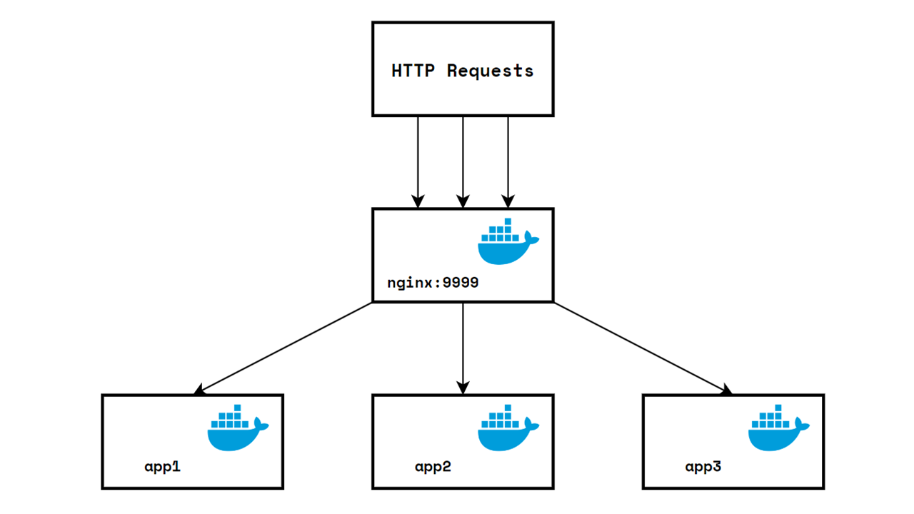
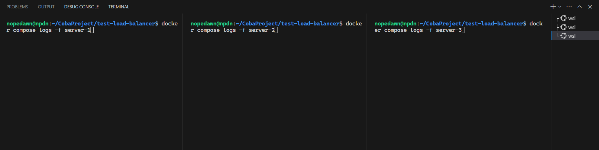
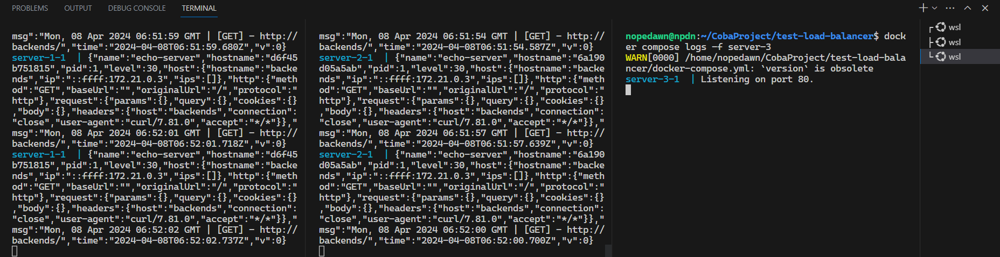

**Docker & Nginx** are both powerful tools used in modern software development and deployment workflows.

Docker is a platform that allows to package, distribute, and run applications in lightweight, portable containers. These containers encapsulate all the dependencies required to run an application, including the code, runtime, system tools, libraries, and settings. Docker containers are isolated from each other and from the host system, ensuring consistent behavior across different environments. Docker simplifies the process of deploying applications, as developers can create containers locally and then deploy them to any environment that supports Docker, whether it's a developer's laptop, a testing server, or a production environment.

Nginx is a high-performance, open-source web server and reverse proxy server. It's known for its efficiency in handling concurrent connections and serving static content quickly. Nginx is often used as a front-end proxy server to route HTTP requests to backend applications or to serve static files directly to clients. It's highly configurable and can be used for various purposes, including load balancing, caching, SSL termination, and serving as a reverse proxy for microservices.

When used together, Docker and Nginx can be a powerful combination for deploying web applications. Here's how they might be used together:

1. Containerization: Developers package their web applications and services into Docker containers. These containers include the application code, runtime, dependencies, and any necessary configuration.

2. Docker Compose: Docker Compose is a tool for defining and running multi-container Docker applications. Developers can use Docker Compose to define the services that make up their application stack, including the web server (Nginx) and any backend services. Docker Compose simplifies the process of managing and orchestrating multiple Docker containers.

3. Nginx as a Reverse Proxy: In many deployment scenarios, Nginx is used as a reverse proxy server to route incoming HTTP requests to the appropriate backend services running in Docker containers. Nginx can also handle tasks like load balancing, SSL termination, and caching.

4. Scaling and Load Balancing: Docker Swarm or Kubernetes can be used to orchestrate multiple Docker containers across a cluster of servers. Nginx can be configured as a load balancer to distribute incoming traffic across the various instances of the application, ensuring high availability and scalability.

5. Static Content Serving: Nginx excels at serving static content efficiently. In a Dockerized environment, Nginx can be used to serve static files directly to clients, offloading this task from the application servers and improving performance.

Docker and Nginx complement each other well, providing developers with powerful tools for building, deploying, and managing modern web applications.

<br>

# Topology



- HTTP Requests: Represents client requests coming into the Nginx server.
- Nginx:9999: Represents the Nginx web server listening on port 9999.
- App1, App2, App3: These sections represent the backend servers that Nginx can forward requests to.

<br>

# Configuration

<hr>

## NGINX

```yml {title="nginx.conf"}
http {
    upstream backends {
        server server-1 weight=2;
        server server-2;
        server server-3 backup;
    }

    server {
        listen 9999;
        location / {
            proxy_pass http://backends/;
        }
    }
}

events {}
```

This configuration for the Nginx server, which acts as a load balancer. Inside the `http` block, there's an `upstream` block named `backends`, which defines a group of backend servers (`server-1`, `server-2`, `server-3`).

- `server-1` is assigned a weight of 2, indicating that it should receive twice as much traffic as the other servers.
- `server-3` is designated as a backup server, meaning it only handles requests if the primary servers (`server-1` and `server-2`) are unavailable.

Inside the server block, there's a location block specifying that all requests should be proxied to the backends group defined earlier.

<br>

## DOCKER

```yml {title="docker-compose.yml"}
version: '3'
services:
  server-1:
    image: ealen/echo-server:latest
    restart: always
    environment:
      - ENABLE__ENVIRONMENT=false

  server-2:
    image: ealen/echo-server:latest
    restart: always
    environment:
      - ENABLE__ENVIRONMENT=false

  server-3:
    image: ealen/echo-server:latest
    restart: always
    environment:
      - ENABLE__ENVIRONMENT=false

  nginx:
    image: nginx
    volumes:
      - "./nginx.conf:/etc/nginx/nginx.conf"
    ports:
      - 9999:9999
```

This docker compose file defines the Docker services for setup. It specifies four services:

- Three services (`server-1`, `server-2`, `server-3`) based on the `ealen/echo-server` Docker image. These services represent the backend servers that will receive traffic from the Nginx load balancer.
- One service (nginx) based on the official Nginx Docker image. It mounts the `nginx.conf` file into the container and exposes port `9999`, where the Nginx server listens for incoming HTTP requests.

<br>

## Build & Run container

```bash {title="up & running container"}
$ docker compose up -d
WARN[0000] /home/nopedawn/CobaProject/test-load-balancer/docker-compose.yml: `version` is obsolete
[+] Running 4/5
 ⠹ Network test-load-balancer_default       Created                                                                                        1.3s
 ✔ Container test-load-balancer-server-2-1  Started                                                                                        1.1s
 ✔ Container test-load-balancer-server-1-1  Started                                                                                        0.9s
 ✔ Container test-load-balancer-nginx-1     Started                                                                                        0.6s
 ✔ Container test-load-balancer-server-3-1  Started                                                                                        0.5s
```

To run it, we can use this command to builds and starts the Docker services defined in the `docker-compose.yml` file in detached mode, meaning it run in the background.

<br>

## Monitoring 

```bash {title="monitoring"}
$ watch -n 1 curl -s localhost:9999

Every 1.0s: curl -s localhost:9999                                                                                npdn: Mon Apr  8 13:43:39 2024
{"host":{"hostname":"backends","ip":"::ffff:172.21.0.3","ips":[]},"http":{"method":"GET","baseUrl":"","originalUrl":"/","protocol":"http"},"request":{"params":{"0":"/"},"query":{},"cookies":{},"body":{},"headers":{"host":"backends","connection":"close","user-agent":"curl/7.81.0","accept":"*/*"}}}
```

This command continuously monitors the output of the `curl -s localhost:9999` command, which fetches the response from the Nginx load balancer. It allows to observe how requests are distributed among the backend servers.

<br>

## Log View



```bash
$ docker compose logs -f server-1
```

```bash
$ docker compose logs -f server-2
```

```bash
$ docker compose logs -f server-3
```

These commands used to view the logs of each individual container (`server-1`, `server-2`, `server-3`) managed by Docker Compose.



<br>

## Stopping the container

```bash {title="stopping container"}
$ docker compose down
WARN[0000] /home/nopedawn/CobaProject/test-load-balancer/docker-compose.yml: `version` is obsolete
[+] Running 5/5
 ✔ Container test-load-balancer-server-2-1  Removed                                                                                        1.1s
 ✔ Container test-load-balancer-server-3-1  Removed                                                                                        1.4s
 ✔ Container test-load-balancer-nginx-1     Removed                                                                                        1.6s
 ✔ Container test-load-balancer-server-1-1  Removed                                                                                        1.2s
 ✔ Network test-load-balancer_default       Removed                                                                                        0.6s
```

To stop it and removes all containers created by Docker Compose. It ensures a clean slate before starting the services again.