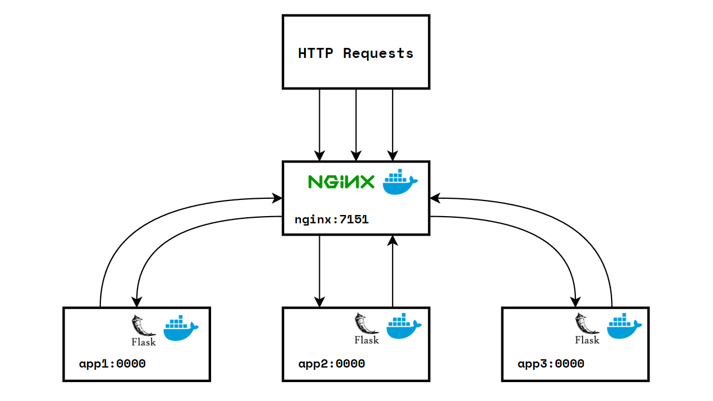
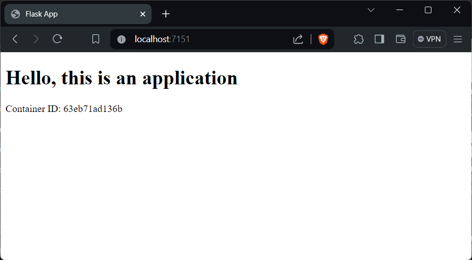

# Introduction

**Flask** is a small and lightweight Python web framework that provides useful tools and features for creating web applications. It's known for its simplicity and flexibility, making it a popular choice among developers.

Creating a web application with Flask can be quick and straightforward. We can build a web application using only a single Python file. This makes Flask a more accessible framework for new developers.

Flask doesn't force a particular directory structure or require complicated boilerplate code before getting started. This means we have the freedom to structure project in a way that best suits needs.

One of the key features of Flask is its extensibility. We can add more functionality to Flask application using extensions. This allows to customize application to fit specific requirements.

Flask uses the Jinja template engine to dynamically build HTML pages using familiar Python concepts such as variables, loops, lists, and so on. This means it can create dynamic web pages without having to write a lot of JavaScript.

Before start building a Flask application, we'll need a local [Python 3](https://www.python.org/downloads/) programming environment. We'll also need an understanding of Python 3 concepts, such as data types, conditional statements, for loops, functions, and other such concepts.

Once we've set up environment, we can install [Flask](https://pypi.org/project/Flask/) using the pip package installer. After that, we're ready to start building Flask application.

<br>

# Topology



- HTTP Requests: Client requests coming into the Nginx server.
- `nginx:7151`: The Nginx web server listening on port 7151.
- `app1`, `app2`, `app3`: These sections are represent the Apps that Nginx can forward requests to *(it will automatically give each app a unique port, after building the container)*.

The topology of the project consists of client requests coming into the Nginx server, which is listening on port `7151`. The Nginx server can forward these requests to multiple Flask applications (`app1`, `app2`, `app3`), each running in its own Docker container. This setup allows for load balancing and efficient distribution of client requests, ensuring that the system can handle a large number of simultaneous connections.

<br>

# Configurations

## Project Structure

```bash {title="tree"}
flask-docker-nginx-lb
├── app
│   ├── Dockerfile
│   ├── requirements.txt
│   ├── templates
│   │   └── index.html
│   └── wsgi.py
├── docker-compose.yml
├── nginx.conf

2 directories, 6 files
```

<br>

## Requirements

```yml {title="requirements.txt"}
flask
gunicorn
```

<br>

## DOCKER

```yml {title="Dockerfile"}
FROM python:3.9-slim

WORKDIR /app

COPY . .

RUN pip install -r requirements.txt

CMD gunicorn --bind 0.0.0.0:5000 wsgi:app
```

The `Dockerfile` contains app will create python environment, `/app` as a working directory, The application's dependencies are listed in a `requirements.txt` file and include Flask and Gunicorn. Gunicorn will binding on port `5000`.

```yml {title="docker-compose.yml"}
version: "3"

services:
  app:
    build:
      context: app
    ports:
      - "5000"

  nginx:
    image: nginx:latest
    volumes:
      - ./nginx.conf:/etc/nginx/nginx.conf:ro
    depends_on:
      - app
    ports:
      - "7151:80"
```

The `docker-compose.yml` file is used to define and run the multi-container Docker app. It specifies the services to run configuration, and the relationships between them. Docker Compose is a tool for defining and managing multi-container Docker apps.

<br>

## NGINX

```yml {title="nginx.conf"}
events {
    worker_connections 1000;
}

http {
    server {
        listen 80;
        location / {
            proxy_pass http://app:5000;
        }
    }
}
```

This nginx configuration file sets up Nginx to listen on port `80` and forward incoming requests to the Flask application running on port `5000`. Nginx is a high-performance HTTP server and reverse proxy. It's known for its high performance, stability, rich feature set, simple configuration, and low resource consumption.

<br>

## WSGI

```py {title="wsgi.py"}
from flask import Flask, render_template
import socket

app = Flask(__name__)

@app.route("/")
def home():
    container_id = socket.gethostname()
    return render_template("index.html", container_id=container_id)

if __name__ == "__main__":
    app.run(debug=True)
```

In the `wsgi.py` contain a Flask application instance is created and a route is defined for the application’s home page. The home page displays a greeting and the ID of the container the application is running in. This is done using the `socket.gethostname()` function, which returns the host name of the current system under which the Python interpreter is executed.

<br>

## Templates

```html {title="index.html"}
<!DOCTYPE html>
<html lang="en">
<head>
    <meta charset="UTF-8">
    <meta name="viewport" content="width=device-width, initial-scale=1.0">
    <title>Flask App</title>
</head>
<body>
    <h1>Hello, this is an application</h1>
    <p>Container ID: {{ container_id }}</p>
</body>
</html>
```

The template `index.html` file is a Jinja template that is rendered by the Flask application. Jinja is a modern and designer-friendly templating language for Python, modelled after Django’s templates. It is fast, widely used and secure with the optional sandboxed template execution environment.

<br>

## Build & Run container

```bash {title="up & running container"}
$ docker compose up -d --build --scale app=3
WARN[0000] /home/nopedawn/CobaProject/flask-docker-nginx-lb/docker-compose.yml: `version` is obsolete
[+] Building 2.0s (9/9) FINISHED                                                               docker:default
 => [app internal] load build definition from Dockerfile                                                 0.0s
 => => transferring dockerfile: 171B                                                                     0.0s
 => [app internal] load metadata for docker.io/library/python:3.9-slim                                   2.0s
 => [app internal] load .dockerignore                                                                    0.0s
 => => transferring context: 2B                                                                          0.0s
 => [app internal] load build context                                                                    0.0s
 => => transferring context: 163B                                                                        0.0s
 => [app 1/4] FROM docker.io/library/python:3.9-slim@sha256:fd8693fc6115345452a19654c1388bc9a1029cda7b9  0.0s
 => CACHED [app 2/4] WORKDIR /app                                                                        0.0s
 => CACHED [app 3/4] COPY . .                                                                            0.0s
 => CACHED [app 4/4] RUN pip install -r requirements.txt                                                 0.0s
 => [app] exporting to image                                                                             0.0s
 => => exporting layers                                                                                  0.0s
 => => writing image sha256:1ce0f68c7e2794b4afa41a2cb3d2708328e3ee636f6148bda2224eaa4d0d51ca             0.0s
 => => naming to docker.io/library/flask-docker-nginx-lb-app                                             0.0s
[+] Running 4/5
 ⠸ Network flask-docker-nginx-lb_default    Created                                                      1.3s
 ✔ Container flask-docker-nginx-lb-app-3    Started                                                      0.9s
 ✔ Container flask-docker-nginx-lb-app-1    Started                                                      0.6s
 ✔ Container flask-docker-nginx-lb-app-2    Started                                                      0.4s
 ✔ Container flask-docker-nginx-lb-nginx-1  Started                                                      1.1s
```

- This command is used to build, (re)create, start, and attach to containers for a service.
- `-d`: This option is used to run the containers in the background (detached mode).
- `--build`: This option is used to build images before starting containers.
- `--scale app=3`: This option is used to start multiple containers for a service. In this case, it starts 3 instances of the `app` service. This is useful when we want to scale up application to handle more traffic.
- The output shows the process of building the Docker image for the Flask application, starting the containers for the application and the Nginx server, and creating the network for the Docker Compose project.

<br>

## View container running

```bash {title="view container recently running"}
$ docker ps
CONTAINER ID   IMAGE                       COMMAND                  CREATED         STATUS         PORTS                                         NAMES
5823d05b8496   nginx:latest                "/docker-entrypoint.…"   5 seconds ago   Up 3 seconds   0.0.0.0:7151->80/tcp, :::7151->80/tcp         flask-docker-nginx-lb-nginx-1
bd5e7e4c228b   flask-docker-nginx-lb-app   "/bin/sh -c 'gunicor…"   5 seconds ago   Up 4 seconds   0.0.0.0:32777->5000/tcp, :::32777->5000/tcp   flask-docker-nginx-lb-app-3
20a370f16776   flask-docker-nginx-lb-app   "/bin/sh -c 'gunicor…"   5 seconds ago   Up 4 seconds   0.0.0.0:32778->5000/tcp, :::32778->5000/tcp   flask-docker-nginx-lb-app-1
63eb71ad136b   flask-docker-nginx-lb-app   "/bin/sh -c 'gunicor…"   5 seconds ago   Up 4 seconds   0.0.0.0:32779->5000/tcp, :::32779->5000/tcp   flask-docker-nginx-lb-app-2
```

The `docker ps` command output shows that the Docker Compose project is successfully running four containers. We can see one of these is an Nginx server, which is listening on port `7151` and is ready to receive incoming HTTP requests. The other three are instances of a Flask application, each running in its own container and listening on a unique port. This setup demonstrates a scalable web application architecture, where an Nginx server acts as a reverse proxy, distributing incoming requests to multiple application instances to balance the load and increase the system's capacity to handle traffic.

<br>

## Web View




We can see in the web display running in the browser on the combined port `nginx:7151`, look at the container ID section if every time we refresh the value on the container ID will change this indicates that the combined port `nginx:7151` has successfully forwarded from the three ports app, this load balancer will be very useful in minimizing a lot of traffic to prevent the server from going down.

<br>

## Stopping the container

```bash {title="stopping container"}
$ docker compose down
WARN[0000] /home/nopedawn/CobaProject/flask-docker-nginx-lb/docker-compose.yml: `version` is obsolete
[+] Running 5/5
 ✔ Container flask-docker-nginx-lb-nginx-1  Removed                                                      0.6s
 ✔ Container flask-docker-nginx-lb-app-3    Removed                                                     10.8s
 ✔ Container flask-docker-nginx-lb-app-1    Removed                                                     11.0s
 ✔ Container flask-docker-nginx-lb-app-2    Removed                                                     10.6s
 ✔ Network flask-docker-nginx-lb_default    Removed                                                      0.6s
```

- This command is used to stop and remove containers, networks, images, and volumes. It's a clean way to ensure that all resources created by `docker compose up` are removed.
- The output shows the process of stopping and removing the containers for the Flask application and the Nginx server, and removing the network for the Docker Compose project.